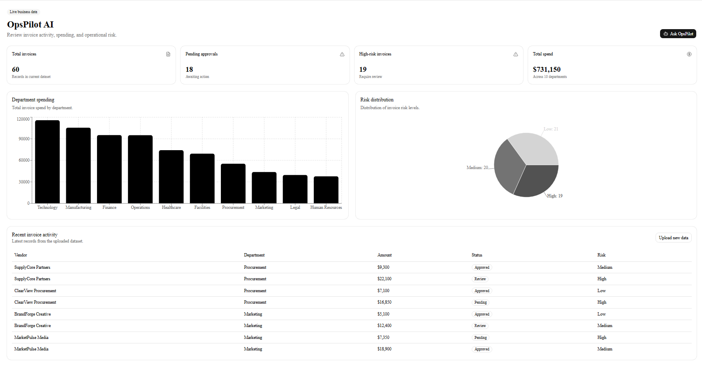
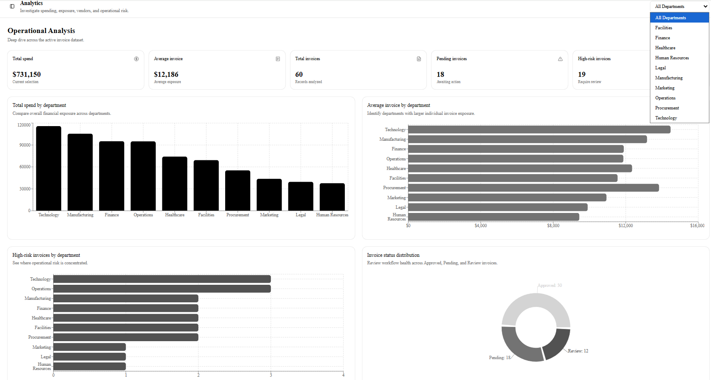
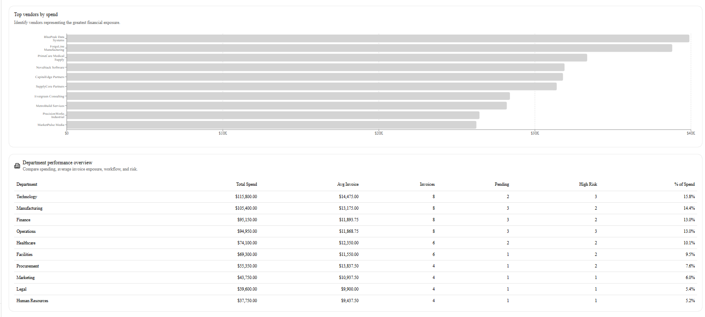
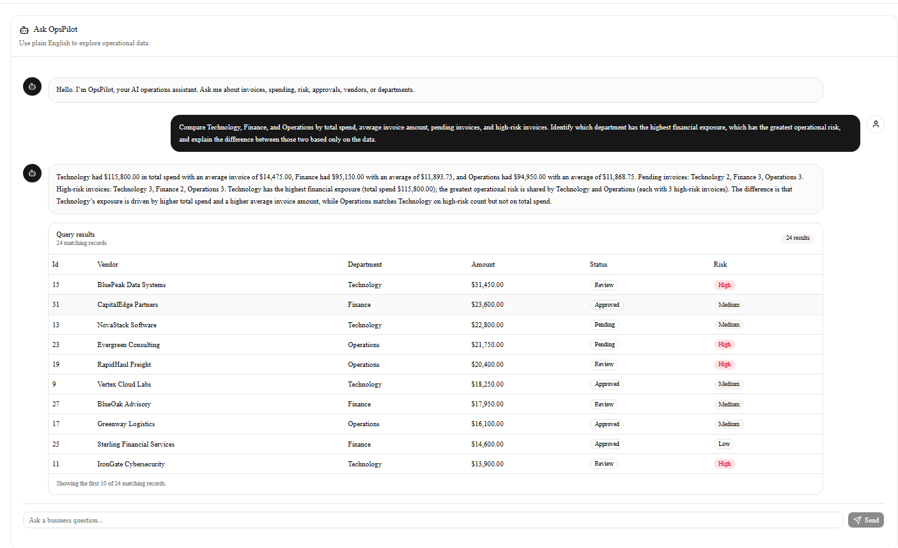
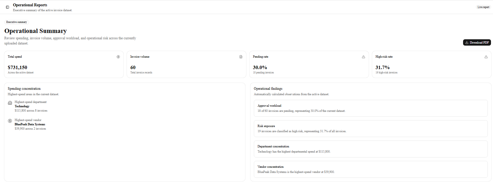

# OpsPilot AI

**AI-powered operations analytics for invoice data.**

OpsPilot AI is a production-deployed full-stack analytics application that transforms operational invoice data into interactive dashboards, risk insights, natural-language analysis, and downloadable executive reports.

Users can upload CSV datasets, explore live analytics, investigate operational trends, ask complex questions through an AI assistant, and generate downloadable PDF reports.

The application combines deterministic data analysis with generative AI so that numerical answers are calculated from structured application data rather than generated by the language model.

---

## Product Overview

OpsPilot AI provides an end-to-end operational analytics workflow:

```text
Upload CSV
    |
    v
Validate & Store Data
    |
    v
PostgreSQL
    |
    +-----------------------+
    |                       |
    v                       v
Dashboard              Analytics
    |                       |
    +-----------+-----------+
                |
                v
         AI Assistant
                |
                v
       Operational Reports
                |
                v
            PDF Export
```

---

## Application Preview

### Operations Dashboard

Monitor the current state of the active invoice dataset through executive-level KPIs, department spending, risk distribution, and recent invoice activity.



---

### Analytics Workspace

Go beyond dashboard monitoring with deeper analysis of spending, invoice exposure, operational risk, workflow status, and vendor concentration.

The Analytics workspace includes department filtering and dynamically recalculates metrics based on the selected department.



The detailed analytics view provides additional risk, vendor, status, and department performance analysis.



---

### AI Assistant

Ask natural-language questions ranging from simple invoice lookups to multi-department operational comparisons.

OpsPilot calculates the requested metrics from structured data and uses AI to explain the verified results.



---

### Operational Reports

Generate executive-level operational summaries and download server-generated PDF reports based on the active dataset.



---

## Overview

Operations teams often rely on spreadsheets and manual analysis to understand spending, invoice status, vendor activity, and operational risk.

OpsPilot AI provides a centralized workflow for ingesting, analyzing, and interpreting operational invoice data.

The application combines:

- CSV data ingestion and validation
- Persistent PostgreSQL storage
- REST API development
- Interactive analytics dashboards
- Department-level analytical filtering
- AI-assisted natural-language querying
- Compound analytical queries
- Risk and status analysis
- Vendor and department comparisons
- Automated PDF reporting
- Production cloud deployment

A core design principle of OpsPilot is that AI should complement deterministic analytics rather than replace them.

Financial calculations, filtering, aggregations, counts, averages, and comparisons are performed against structured application data. Verified results are then provided to the AI layer for interpretation and natural-language summarization.

---

# Features

## Live Operations Dashboard

Monitor operational KPIs including:

- Total invoice count
- Total spend
- Pending approvals
- High-risk invoices
- Department-level spending
- Risk distribution
- Recent invoice activity

Dashboard metrics automatically update whenever a new dataset is uploaded.

The Dashboard is intentionally designed as an executive monitoring workspace, providing a fast overview of the current operational state.

---

## CSV Data Import

Upload invoice datasets directly through the application.

OpsPilot:

1. Accepts CSV uploads through the frontend.
2. Validates required columns and invoice values.
3. Rejects malformed datasets.
4. Imports valid records into the backend.
5. Replaces the currently active dataset.
6. Recalculates analytics automatically.
7. Persists the active dataset in PostgreSQL.

Uploaded production data survives backend restarts and application redeployments.

---

## Analytics Workspace

The Analytics workspace is designed for deeper investigation rather than simple monitoring.

Users can analyze:

- Total spending by department
- Average invoice amount by department
- High-risk invoices by department
- Top vendors by spend
- Invoice status distribution
- Department financial exposure
- Department operational risk
- Pending invoice concentration
- Vendor concentration
- Department contribution to total spending

A department filter allows users to isolate a specific department and dynamically recalculate the analytical view.

### Department Performance Analysis

The department performance table compares:

- Total spend
- Average invoice amount
- Invoice count
- Pending invoices
- High-risk invoices
- Percentage of overall spending

This allows users to compare financial exposure and operational risk within the same workspace.

---

## OpsPilot AI Assistant

Ask natural-language questions about operational data.

The assistant supports both simple lookups and compound analytical questions.

### Basic Questions

```text
How many invoices are there?

How much did Technology spend?

Which vendor has the highest spending?

Show invoices between $5,000 and $10,000.

Which invoices are high risk?

Show high-risk pending invoices.
```

### Compound Analysis

OpsPilot can also process questions involving multiple departments, filters, metrics, and analytical objectives.

For example:

```text
Show me all high-risk invoices between $7,000 and $20,000,
identify which department has the most of them,
calculate their total spend,
and tell me which vendor represents the largest financial exposure.
```

Another example:

```text
Compare Technology and Manufacturing spending
and tell me which department has more high-risk invoices.
```

More advanced comparisons can combine several metrics:

```text
Compare Technology, Finance, and Operations by total spend,
average invoice amount, pending invoices, and high-risk invoices.

Identify which department has the highest financial exposure,
which has the greatest operational risk,
and explain the difference between those two based only on the data.
```

The assistant converts the user's question into a structured analysis plan, applies the required filters, calculates verified metrics, and provides those results to the AI layer for explanation.

Relevant invoice records are displayed beneath the response so users can inspect the underlying data used in the analysis.

---

# Compound Analysis Engine

OpsPilot supports multi-part analytical questions rather than limiting each request to a single intent.

The query-planning layer can identify:

- Multiple departments
- Specific vendors
- Risk classifications
- Invoice statuses
- Minimum invoice amounts
- Maximum invoice amounts
- Requested metrics
- Requested analytical breakdowns

Supported metrics include:

- Invoice count
- Total spend
- Average invoice amount
- Pending invoice count
- Approved invoice count
- Review invoice count
- High-risk invoice count
- Medium-risk invoice count
- Low-risk invoice count

Breakdowns can be generated across:

- Departments
- Vendors
- Risk levels
- Invoice statuses

This allows OpsPilot to answer comparison and multi-condition questions while keeping calculations grounded in application data.

---

# Operational Reports

Generate an executive-level operational summary containing:

- Total spend
- Invoice volume
- Pending approval rate
- High-risk rate
- Highest-spend department
- Highest-spend vendor
- Key operational findings

Reports are generated dynamically from the active production dataset.

---

# PDF Export

Download an operational summary as a PDF directly from the Reports workspace.

PDF documents are generated server-side using ReportLab and reflect the currently active dataset.

---

# Architecture

```text
                         OpsPilot AI
                              |
                +-------------+-------------+
                |                           |
         Next.js Frontend             FastAPI Backend
                |                           |
             Vercel                      Render
                |                           |
                +--------- REST API --------+
                                            |
                         +------------------+------------------+
                         |                                     |
                    PostgreSQL                           OpenAI API
                         |                                     |
                  Persistent Data                       Query Planning
                  Invoice Records                       Result Summaries
                         |
              +----------+----------+
              |                     |
         Analytics Engine      Report Generator
              |                     |
        Verified Metrics          PDF Export
```

---

# Data Flow

```text
CSV Upload
    |
    v
FastAPI Validation
    |
    v
PostgreSQL
    |
    +-----------------------+
    |                       |
    v                       v
Dashboard API         Analysis Engine
    |                       |
    v                       v
Analytics UI         Structured Query Plan
                            |
                            v
                     Filtered Dataset
                            |
                            v
                   Deterministic Metrics
                            |
                            v
                       OpenAI API
                            |
                            v
                  Natural-Language Summary
                            |
                            v
                   Verified Results Table
```

---

# AI Analysis Flow

OpsPilot separates natural-language interpretation from numerical analysis.

```text
User Question
     |
     v
OpenAI Query Planner
     |
     v
Structured Analysis Plan
     |
     v
Python / Database Filtering
     |
     v
Verified Dataset
     |
     +-----------------------+
     |                       |
     v                       v
Metrics & Breakdowns     Results Table
     |
     v
OpenAI Summarization
     |
     v
Natural-Language Answer
```

This design helps prevent inconsistencies between the assistant's response and the underlying invoice records.

---

# Tech Stack

## Frontend

- Next.js
- React
- TypeScript
- Tailwind CSS
- shadcn/ui
- Recharts
- Lucide React

## Backend

- Python
- FastAPI
- SQLAlchemy
- Uvicorn
- Pydantic

## Database

### Production

- PostgreSQL
- Render PostgreSQL

### Local Development

- SQLite

The database layer automatically uses PostgreSQL when a `DATABASE_URL` environment variable is available and falls back to SQLite for local development.

## AI

- OpenAI API
- Natural-language query planning
- Structured analytical plans
- Database-grounded response generation
- Compound analytical queries

## Reporting

- ReportLab
- Server-side PDF generation

## Deployment

- Vercel — frontend
- Render — FastAPI backend
- Render PostgreSQL — persistent production database
- GitHub — source control and deployment integration

---

# Project Structure

```text
opspilot-ai/
|
+-- app/
|   +-- analytics/
|   +-- assistant/
|   +-- reports/
|   +-- upload/
|   +-- page.tsx
|
+-- components/
|   +-- assistant/
|   +-- dashboard/
|   |   +-- average-invoice-chart.tsx
|   |   +-- high-risk-department-chart.tsx
|   |   +-- risk-chart.tsx
|   |   +-- spending-chart.tsx
|   |   +-- status-chart.tsx
|   |   +-- vendor-chart.tsx
|   |
|   +-- layout/
|   +-- ui/
|
+-- lib/
|   +-- api.ts
|
+-- backend/
|   +-- app/
|   |   +-- services/
|   |   |   +-- ai_service.py
|   |   |   +-- report_service.py
|   |   |
|   |   +-- database.py
|   |   +-- main.py
|   |
|   +-- requirements.txt
|
+-- public/
|   +-- screenshots/
|       +-- dashboard.png
|       +-- analytics.png
|       +-- analytics2.png
|       +-- assistant.png
|       +-- reports.png
|
+-- README.md
```

---

# CSV Format

OpsPilot expects CSV files containing the following columns:

| Column | Description |
|---|---|
| `vendor` | Vendor or supplier name |
| `department` | Department responsible for the invoice |
| `amount` | Invoice amount |
| `status` | Invoice workflow status |
| `risk` | Assigned risk classification |

Example:

```csv
vendor,department,amount,status,risk
Northstar Systems,Technology,5200,Approved,Medium
Orion Manufacturing,Manufacturing,4813,Pending,Low
Apex Medical,Healthcare,4426,Review,High
```

Uploading a new valid dataset replaces the currently active invoice dataset.

---

# Running Locally

## Prerequisites

Install:

- Node.js
- npm
- Python 3
- Git

An OpenAI API key is required for AI Assistant functionality.

---

## 1. Clone the repository

```bash
git clone https://github.com/somesh3516/opspilot-ai.git
cd opspilot-ai
```

---

## 2. Install frontend dependencies

```bash
npm install
```

---

## 3. Configure the backend

Navigate to the backend:

```bash
cd backend
```

Create a Python virtual environment:

```bash
python -m venv .venv
```

Activate it on Windows Command Prompt:

```cmd
.venv\Scripts\activate.bat
```

On macOS/Linux:

```bash
source .venv/bin/activate
```

Install backend dependencies:

```bash
pip install -r requirements.txt
```

---

## 4. Configure environment variables

Create:

```text
backend/.env
```

Add:

```text
OPENAI_API_KEY=your_openai_api_key
```

For local development, `DATABASE_URL` is optional.

Without `DATABASE_URL`, OpsPilot automatically uses a local SQLite database.

To run locally against PostgreSQL, provide:

```text
DATABASE_URL=your_postgresql_connection_string
```

Never commit `.env` files or database credentials to source control.

---

## 5. Start the backend

From the `backend` directory:

```bash
uvicorn app.main:app --reload
```

The API runs at:

```text
http://127.0.0.1:8000
```

Health check:

```text
http://127.0.0.1:8000/health
```

---

## 6. Start the frontend

Open another terminal from the project root:

```bash
npm run dev
```

The application runs at:

```text
http://localhost:3000
```

---

# Production Environment Variables

The production backend requires environment variables including:

```text
OPENAI_API_KEY
DATABASE_URL
FRONTEND_URL
```

### `OPENAI_API_KEY`

Provides access to the OpenAI API for natural-language query planning and result summarization.

### `DATABASE_URL`

Connects the FastAPI backend to the production PostgreSQL database.

### `FRONTEND_URL`

Defines the production frontend origin permitted by backend CORS configuration.

Secrets are configured through the deployment platform and are never committed to Git.

---

# API Endpoints

| Method | Endpoint | Purpose |
|---|---|---|
| `GET` | `/` | API status |
| `GET` | `/health` | Backend health check |
| `GET` | `/dashboard` | Dashboard and analytics data |
| `GET` | `/invoices` | Retrieve invoice records |
| `POST` | `/upload` | Validate and import CSV data |
| `POST` | `/assistant` | Submit natural-language analytical questions |
| `GET` | `/reports/operational-summary.pdf` | Generate operational PDF report |

---

# AI Design

OpsPilot uses a database-grounded AI architecture.

Instead of asking a language model to independently calculate business metrics, the application separates the workflow into two AI-assisted stages.

## Stage 1 — Query Planning

The AI interprets the user's natural-language question and converts it into a structured analysis plan.

For example:

```text
Compare Technology and Manufacturing spending
and tell me which has more high-risk invoices.
```

can be represented internally as a plan containing:

```text
Departments:
- Technology
- Manufacturing

Metrics:
- Total spend
- High-risk invoice count

Breakdown:
- Department
```

## Stage 2 — Verified Analysis

The application then:

1. Applies the requested filters to structured invoice records.
2. Calculates metrics programmatically.
3. Generates department, vendor, status, or risk breakdowns.
4. Identifies relevant invoice records.
5. Sends verified analytical output to the AI summarization layer.
6. Generates a concise business explanation.
7. Displays the underlying records to the user.

The AI therefore interprets and explains the analysis while application code remains responsible for quantitative calculations.

---

# Database Persistence

Production invoice data is stored in PostgreSQL.

This means uploaded datasets survive:

- Backend restarts
- Render service restarts
- Application redeployments
- New code deployments

SQLite remains available as a lightweight local-development fallback.

---

# Example Workflow

```text
Upload Invoice CSV
        |
        v
Validate Records
        |
        v
Persist to PostgreSQL
        |
        v
View Dashboard KPIs
        |
        v
Explore Analytics
        |
        v
Ask OpsPilot Questions
        |
        v
Generate Structured Analysis
        |
        v
Review AI Summary + Records
        |
        v
Generate Executive Report
        |
        v
Download PDF
```

---

# Production Deployment

OpsPilot AI uses a multi-service cloud architecture.

## Frontend

The Next.js application is deployed through Vercel.

## Backend

The FastAPI REST API is deployed through Render.

## Database

Production data is stored in PostgreSQL through Render.

## Deployment Workflow

```text
Local Development
       |
       v
      Git
       |
       v
    GitHub
       |
       +------------------+
       |                  |
       v                  v
    Vercel              Render
   Frontend             Backend
                           |
                           v
                       PostgreSQL
```

Changes pushed to the main GitHub branch can trigger production deployments.

---

# Current Limitations

OpsPilot currently:

- Supports one active dataset at a time
- Requires a defined CSV column structure
- Focuses primarily on invoice and operational spend analysis
- Does not currently provide user accounts or dataset ownership
- Does not maintain historical versions of replaced datasets
- Does not currently provide date-based invoice trend analysis

These constraints keep the current release focused while leaving clear opportunities for expansion.

---

# Future Improvements

Potential future development includes:

- Automatic CSV column mapping
- Multiple saved datasets
- Historical upload tracking
- Date-range analysis
- Time-series spending trends
- Dataset-to-dataset comparison
- User authentication
- Role-based access control
- Organization-level workspaces
- Advanced anomaly detection
- Automated risk scoring
- Additional report formats
- Scheduled reports
- Audit logging
- Database migrations
- Automated testing
- CI/CD improvements

---

# Security

Sensitive configuration is excluded from source control.

The repository ignores:

- `.env` files
- OpenAI API credentials
- Database connection credentials
- Python virtual environments
- Local SQLite databases
- Python cache files
- Next.js build artifacts
- Node modules

Production secrets are supplied through environment variables.

The frontend communicates with the backend through configured CORS origins rather than exposing backend credentials to the browser.

---

# Engineering Highlights

OpsPilot AI demonstrates experience across:

- Full-stack application development
- REST API design
- PostgreSQL integration
- SQLAlchemy database connectivity
- CSV ingestion and validation
- Data aggregation and analytics
- Interactive dashboard development
- Dynamic analytical filtering
- Generative AI integration
- Structured AI query planning
- Grounded AI response generation
- Compound analytical queries
- Server-side document generation
- Environment-based configuration
- Cloud deployment
- Production database persistence
- Git/GitHub development workflows

---

# Author

**Somesh Dixit**

Full-stack software engineering, data analytics, automation, and AI-enabled business applications.

---

# Project Status

**Production MVP deployed**

Core functionality includes:

- CSV ingestion and validation
- Persistent PostgreSQL storage
- Database-backed analytics
- Interactive dashboards
- Department-level analytical filtering
- Compound AI-assisted querying
- Operational risk analysis
- Vendor and department comparisons
- Executive reporting
- PDF export
- Production frontend deployment
- Production backend deployment
- Persistent cloud database integration

OpsPilot AI is currently deployed as a functional full-stack production MVP.